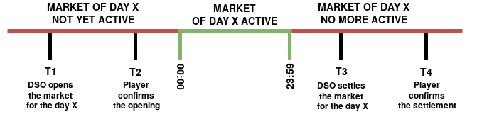
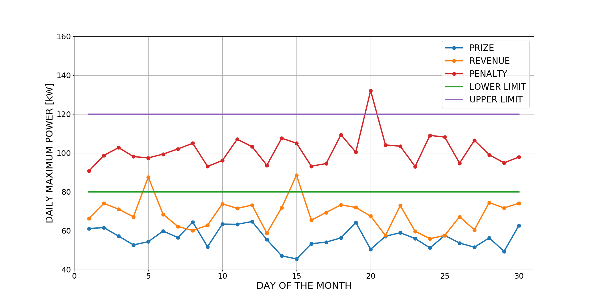

Market definition
==================

Each energy market is ruled by the smart contract :code:`MarketsManager` and defined by:

- a **DSO** wallet (Distribution System Operator) (:code:`dso`), who provides the energy
- an **user** wallet (:code:`player`), whose energy is provided by the DSO
- an ERC20 **token** (named NGT, NemoGrid Token), the cryptocurrency used to stake and distribute revenues/penalties
- a **period**, typically a day, when the market is active. Currently monthly, daily and hourly markets can be created.
- a **lower limit** (:code:`maxLow`), related to the power consumed by the user
- a **upper limit** (:code:`maxUp`), related to the power consumed by the user
- a **revenue factor** (:code:`revFactor`), which defines the :code:`player` revenue if the maximum needed power is in the interval :code:`[maxLow : maxUp]`
- a **penalty factor** (:code:`penFactor`), which defines the :code:`player` penalty if the maximum needed power is greater than :code:`maxUp`
- a **NGT staking** (:code:`dsoStaking`) performed by the :code:`dso`
- a **NGT staking** (:code:`playerStaking`) performed by the :code:`player`
- a **referee** trusted wallet (:code:`referee`), which takes the final decision if :code:`dso` and :code:`player` do not agree
- a **percentage** (:code:`revPercReferee`) on the staked tokens for the :code:`referee`, in order to pay its intervention

Operations sequence
===================

First at all, :code:`dso` and :code:`player` agree off-chain on the aforementioned market features,
then they sequentially send the following on-chain transactions:

.. code::

   T1 -> OPENING: dso opens the market setting all its parameters (maximum limits, period, etc.) and stake its NGTS
   T2 -> OPENING_CONFIRM: player confirms the market opening and stake its NGTS

The opening operations have to be performed before the beginning of the market.
Then, after the period end, the market can be settled with the following transactions:

.. code::

   T3 -> SETTLE: dso settles the market, sending the maximum consumption of Player to the contract
   T4 -> SETTLEMENT_CONFIRM: player confirms or not the maximum consumption

The following picture reports an example of sequence for a daily market.

If :code:`player` does not confirm the opening (i.e. in the figure above :code:`player` does not perform :code:`T2`),
after the day beginning :code:`dso` is allowed to request the refund of its staking with a further transaction.

In case :code:`dso` and :code:`player` do not agree about the settlement, an additional transaction is needed to define the market result.
This is performed by :code:`referee`, a trusted wallet decided by :code:`dso` and :code:`player` during the opening transactions.

Markets solving
===============

In the following picture the possible cases of the markets solving are shown.
It is supposed :code:`dso` and :code:`player` agree about the maximum consumption measurement, i.e. no :code:`referee` intervention is needed.
In the figure monthly markets are taken into account, the operating mode is equal for the other market types (daily and hourly).

The curves represents the daily maximum consumption for three different markets, with the same maximum power limits (green and violet lines).

Each curve corresponds to a possible result, which is following explained:

- **PRIZE:** the daily maximums never exceed the lower limit (:code:`maxLow`). This means that at the market settlement :code:`player` will be rewarded with all the tokens staked by :code:`dso`.
- **REVENUE:** it happens the daily maximums sometimes exceed the lower limit (:code:`maxLow`), never reaching the upper one (:code:`maxUp`). As a consequence, at the market settlement :code:`player` will be rewarded with a part of the tokens staked by :code:`dso`.
- **PENALTY:** the daily maximums sometimes exceed the upper limit (:code:`maxUp`). Given this situation, at the market settlement :code:`dso` will be rewarded with a part of/all the tokens staked by :code:`player`.

Revenue/penalty/crash calculation
==================================

As explained above, when the final result of a market is :code:`Revenue`/:code:`Penalty`, a part of the tokens staked by :code:`dso`/:code:`player`
becomes a reward for :code:`player`/:code:`dso`.

The reward amount is calculated by the smart contract taking into account the maximum power consumed by :code:`player` during the market.
The calculation is defined as follows:

.. code::

    # Revenue
    playerRevenue = dsoStaking - (powerPeak - maxLow) * revFactor

.. code::

    # Penalty
    IF ((powerPeak - maxUp) * penFactor) >= playerStaking:
        # Crash
        playerPenalty = playerStaking
    ELSE:
        playerPenalty = (powerPeak - maxUp) * penFactor

where :code:`powerPeak` is the maximum consumption of the :code:`player` during the month.

Considering the figure above, :code:`powerPeak` is the maximum power measured during day 15 for :code:`Revenue` and day 20 for :code:`Penalty` curves.

If the penalty exceeds :code:`playerStaking`, then all the tokens staked by :code:`player` are lost.
In this case the market result changes from :code:`Penalty` to :code:`Crash`.

Referee intervention
=====================

When :code:`dso` and :code:`player` do not agree on the measured :code:`powerPeak`, the market is resolved by a trusted :code:`referee`.
It decides the token rewards as follows:

.. code::

    refereeReward = (dsoStaking + playerStaking) * revPercReferee
    honestReward = dsoStaking + playerStaking - referee_reward

    # Player is a cheater
    IF dsoPowerPeak == refereePowerPeak:
        # honestReward tokens are sent to DSO, the cheating player receives nothing
        dsoReward = honestReward
        playerReward = 0

    # DSO is a cheater
    ELSE IF playerPowerPeak == refereePowerPeak:
        # honestReward tokens are sent to player, the cheating DSO receives nothing
        playerReward = honestReward
        dsoReward = 0

    # Both DSO and Player are cheaters
    ELSE:
        # honestReward tokens are burnt, neither DSO nor player receive anything
        playerReward = 0
        dsoReward = 0

where :code:`dsoPowerPeak`/:code:`playerPowerPeak`/:code:`refereePowerPeak` is the maximum power
declared during the settlements operations by :code:`dso`/:code:`player`/:code:`referee`.